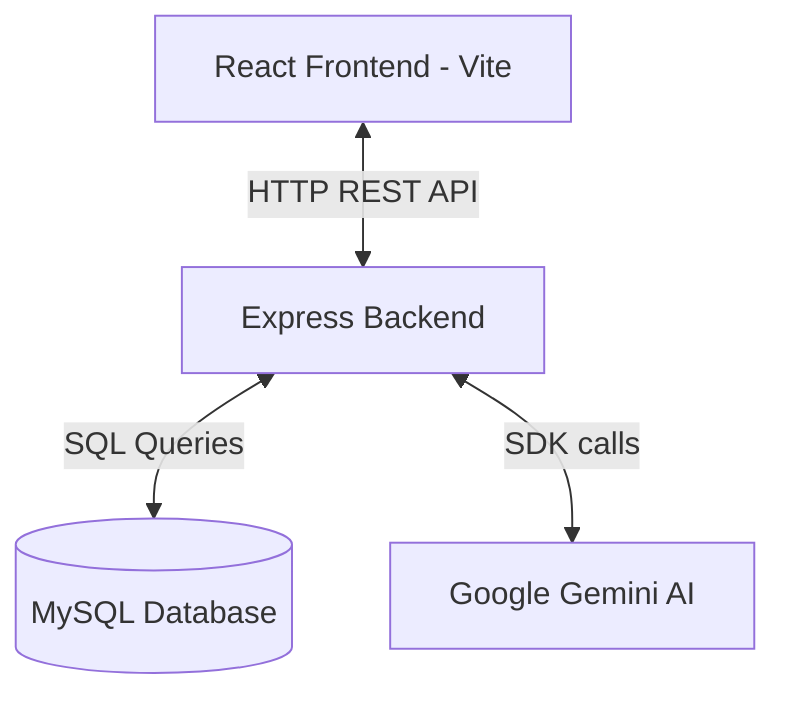

# AI-Powered ChatGPT Clone

Developed by **Desta Getaw Mekonnen**

A full-stack, production-ready ChatGPT clone built with **React (Vite)**, **Node.js (Express)**, **MySQL**, and integrated with the **Google Gemini API** (using the official `@google/genai` SDK).

This project features multi-turn conversation threads, dynamic chat history, markdown-rendered AI responses, state synchronization between frontend and backend, and automatic database migrations.

---

## 🏗️ Architecture & Features



- **State-Synced Thread Management:** Create new chats, keep track of past threads, and switch between them seamlessly.
- **Multi-turn Contextual AI Chatting:** Sends conversation history context to Gemini so that the model understands follow-up questions.
- **Optimistic UI Updates:** Messages appear immediately in the chat viewport with an animated loading state while the AI is responding.
- **Markdown & Code Rendering:** Beautiful rendering of markdown responses, list bullets, code blocks, blockquotes, and highlights.
- **Clean Design & Micro-animations:** Premium dark mode UI styled with vanilla CSS.

---

## 🛠️ Tech Stack

- **Frontend:** React 19, Vite, Axios, Lucide React (Icons), React Markdown
- **Backend:** Node.js, Express, dotenv, CORS, MySQL2 (Promise pool)
- **AI Integration:** `@google/genai` (SDK) utilizing `gemini-2.5-flash`
- **Database:** MySQL (relational database storing conversation headers and message history)

---

## 📋 Prerequisites

Ensure you have the following installed on your local machine:
- **Node.js** (v18 or higher recommended)
- **MySQL Server**
- A **Gemini API Key** (obtainable from [Google AI Studio](https://aistudio.google.com/))

---

## 🚀 Setup & Installation

### 1. Database Setup
Create a new MySQL database named `chatgpt_clone`.
The application handles the table creation automatically through a migration script.

### 2. Backend Configuration
Navigate to the `backend` folder:
```bash
cd backend
```

Create a `.env` file in the `backend` folder and populate it with your database credentials and Gemini API key:
```env
DB_HOST=localhost
DB_USER=your_mysql_user
DB_PASSWORD=your_mysql_password
DB_NAME=chatgpt_clone

# Gemini API configuration
GEMINI_API_KEY=your_gemini_api_key
GEMINI_MODEL=gemini-2.5-flash
```

### 3. Run Database Migrations
To create the necessary database tables (`chat_conversations` and `conversations`), run the migration script inside the `backend` folder:
```bash
node migrate.js
```

### 4. Install Dependencies
Install dependencies for both the frontend and backend:
```bash
# Install backend dependencies
cd backend
npm install

# Install frontend dependencies
cd ../frontend
npm install
```

---

## 🏃 Run the Application

To run the application, open two terminal windows:

### Terminal 1: Backend
```bash
cd backend
node index.js
```
The backend server runs on `http://localhost:3888`.

### Terminal 2: Frontend
```bash
cd frontend
node node_modules/vite/bin/vite.js
```
The frontend dev server runs on `http://localhost:5173`. Open this URL in your web browser.

---

## 🔗 Backend API Reference

### 1. Create a New Conversation Thread
- **Route:** `POST /api/chat/conversations/new`
- **Body:** *(Optional)* `{"title": "Custom Title"}`
- **Response (201):**
  ```json
  {
    "success": true,
    "message": "New conversation created.",
    "data": {
      "id": 1,
      "title": "New Chat",
      "created_at": "2026-06-28T03:00:00.000Z"
    }
  }
  ```

### 2. Send Message inside a Thread
- **Route:** `POST /api/chat/conversations`
- **Body:** `{"question": "Your message", "conversationId": 1}`
- **Response (201):**
  ```json
  {
    "success": true,
    "message": "Message sent successfully.",
    "data": {
      "userConversation": {
        "id": 1,
        "role": "user",
        "content": "Your message",
        "createdAt": "2026-06-28T03:00:05.000Z"
      },
      "assistantConversation": {
        "id": 2,
        "role": "assistant",
        "content": "AI response text...",
        "tokenCount": 120,
        "createdAt": "2026-06-28T03:00:08.000Z"
      }
    }
  }
  ```

### 3. Get Conversations List (Sidebar)
- **Route:** `GET /api/chat/conversations`
- **Response (200):** Returns all conversation headers sorted by the most recently updated.

### 4. Get Conversation Messages
- **Route:** `GET /api/chat/conversations/:id/messages`
- **Response (200):** Returns the chronological history of messages for the specified conversation ID.

---

<p align="center">
  Developed by <b>Desta Getaw Mekonnen</b><br>
  <i>Senior Full-Stack Software Engineer</i>
</p>

